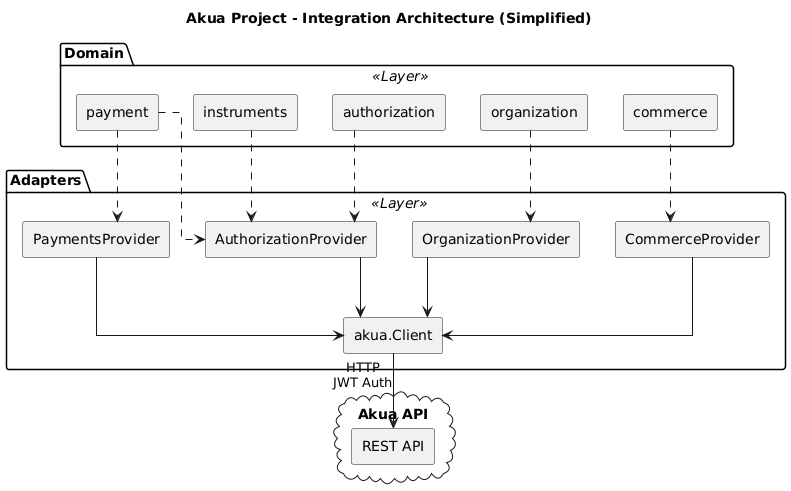

# Payment Flows Documentation

This directory contains comprehensive payment flow implementations for the Akua payment integration. Each flow demonstrates different payment processing scenarios including authorization, capture, refund, and reversal operations.

## Table of Contents

- [Prerequisites](#prerequisites)
- [Environment Setup](#environment-setup)
- [How to execute and test a flow](#how-to-execute-and-test-a-flow)
- [Architecture Overview](#architecture-overview)
- [Flow Documentation](#flow-documentation)
  - [1. Authorization with Auto Capture](#1-authorization-with-auto-capture)
  - [2. Authorization with Manual Capture](#2-authorization-with-manual-capture)
  - [3. Authorization with Manual Reversal](#3-authorization-with-manual-reversal)
  - [4. Authorization with Auto Refund](#4-authorization-with-auto-refund)

## Prerequisites

Before running the tests, ensure you have:

- **Go 1.24.6** or higher installed
- **Akua API credentials** with appropriate permissions
- Access to the Akua API environment (sandbox or production)
- Network connectivity to the Akua API endpoints

## Environment Setup

Create a `.env` file in the project root with the following environment variables:

```env
AKUA_CLIENT_ID=your_client_id
AKUA_CLIENT_SECRET=your_client_secret
AKUA_AUDIENCE=https://sandbox.akua.la
AKUA_ORGANIZATION_ID=your_organization_id
AKUA_COMMERCE_ID=your_commerce_id
```

These credentials are required for:

- OAuth token authentication
- API request authorization

## How to execute and test a flow

1. Define which flow you want to execute. You can select one of the following:

   - Authorize automatic capture
     - Flow Diagram: [Flow explanation](internal/flows/authorize_auto_capture/)
   - Authorize with manual capture
     - Flow Diagram: [Flow explanation](internal/flows/authorize_manual_cature/)
   - Authorize with reversal
     - Flow Diagram: [Flow explanation](internal/flows/authorize_manual_reversal/)
   - Authorize with refund
     - Flow Diagram: [Flow explanation](internal/flows/authorize_auto_refund/)

   ***

   ```
   go test -v ./internal/flows/authorize_auto_capture
   go test -v ./internal/flows/authorize_auto_refund
   go test -v ./internal/flows/authorize_manual_cature
   go test -v ./internal/flows/authorize_manual_reversal
   ```

## Architecture Overview

### Flow Structure



All flows follow a consistent structure:

```
internal/adapters/
├── akua
internal/domain_modules**/
├── organization
├── commerce
├── authorization
├── instruments
├── payment
internal/flows/
├── authorize_auto_capture/
│   ├── flow_test.go          # Test implementation
│   └── flow_diagram.puml     # Sequence diagram
├── authorize_manual_cature/
│   ├── flow_test.go
│   └── flow_diagram.puml
├── authorize_manual_reversal/
│   ├── flow_test.go
│   └── flow_diagram.puml
└── authorize_auto_refund/
    ├── flow_test.go
    └── flow_diagram.puml
```

### Common Components

All flows utilize:

1. **Akua Client** (`internal/adapters/akua`)

   - HTTP client wrapper
   - JWT token management
   - OAuth authentication

2. **Authorization Provider** (`internal/adapters/akua/authorization`)

   - `Authorize()` - Create payment authorization
   - `Capture()` - Capture an authorized payment
   - `Reversal()` - Reverse an authorized payment
   - `Refund()` - Refund a captured payment

3. **Payments Provider** (`internal/adapters/akua/payments`)
   - `GetPaymentById()` - Retrieve payment details
   - Payment state verification

## Flow Comparison Matrix

| Flow                | Capture Mode | Initial Status          | Final Action | Final Status | Use Case                     |
| ------------------- | ------------ | ----------------------- | ------------ | ------------ | ---------------------------- |
| **Auto Capture**    | `AUTOMATIC`  | `APPROVED`              | N/A          | `APPROVED`   | Immediate payment processing |
| **Manual Capture**  | `MANUAL`     | `AUTHORIZED`            | Capture      | `CAPTURED`   | Delayed capture scenarios    |
| **Manual Reversal** | `MANUAL`     | `AUTHORIZED`            | Reversal     | `CANCELLED`  | Cancel before capture        |
| **Auto Refund**     | `AUTOMATIC`  | `AUTHORIZED`/`CAPTURED` | Refund       | `REFUNDED`   | Return funds after capture   |

---

## Transaction Types Reference

Throughout the flows, you'll encounter these transaction types:

- **AUTHORIZATION** - Initial payment authorization
- **CAPTURE** - Capture of authorized funds
- **REVERSAL** - Cancellation of authorization (before capture)
- **REFUND** - Return of funds (after capture)

---

## Additional Resources

- [Akua API Documentation](https://docs.akua.la) - Official API reference
- [Integration Architecture](./../adapters/akua/integration_structure.puml) - System architecture diagram
- [Authorization Cases](./../adapters/akua/authorization/cases.puml) - Error case scenarios

---

## Support

For issues or questions:

1. Review the flow diagrams for visual flow representation
2. Check test output with `-v` flag for detailed logs
3. Verify environment configuration
4. Consult Akua API documentation

---

**Last Updated:** Generated from codebase analysis
**Go Version:** 1.24.6
**Test Framework:** Go testing package with testify assertions
