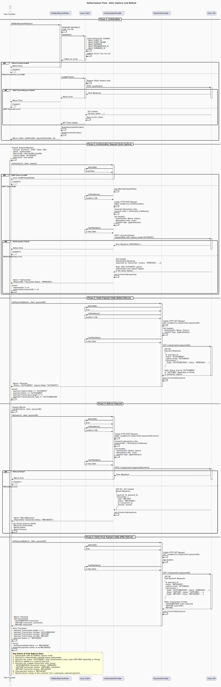

### 4. Authorization with Auto Refund

**Flow Path:** `internal/flows/authorize_auto_refund/`



**Description:**
This flow demonstrates refunding a payment that was authorized and automatically captured. Refund is used to return money to a customer for a payment that has already been captured. This is different from reversal, which cancels an authorization before capture.

**Key Characteristics:**

- **Capture Mode:** `AUTOMATIC`
- **Initial Status:** `AUTHORIZED` (auto-captured)
- **After Refund:** `REFUNDED`
- **Use Case:** Customer returns, order cancellations after fulfillment, refund requests

**Flow Steps:**

1. **Initialization**

   - Load environment variables
   - Create Akua client and providers
   - Load JWT token

2. **Authorization Request (Auto Capture)**

   - Prepare `AuthorizeRequest` with `Capture.Mode: "AUTOMATIC"`
   - Send POST request to `/v1/authorizations`
   - Payment is automatically authorized and captured

3. **Verify Payment State (Before Refund)**

   - Retrieve payment by ID
   - Verify payment status is `"AUTHORIZED"`
   - Verify capture mode is `"AUTOMATIC"`
   - Note: Payment may show as captured depending on timing

4. **Refund Request**

   - Call `Refund()` method with payment ID
   - Send POST request to `/v1/payments/{id}/refund`
   - Process refund response

5. **Verify Final Payment State (After Refund)**
   - Retrieve payment to verify refund
   - Confirm payment status changed to `"REFUNDED"`
   - Verify multiple transactions exist:
     - AUTHORIZATION transaction
     - CAPTURE transaction (automatic)
     - REFUND transaction

**Expected Result:**

- Payment initially authorized and automatically captured
- After refund, payment status is `"REFUNDED"`
- Payment contains AUTHORIZATION, CAPTURE, and REFUND transactions
- Funds are returned to the customer

**Test Function:**

```go
Test_Authorize_AutomaticCapture_Refund_Success
```

**Important Notes:**

- Refund requires a captured payment (unlike reversal which requires an authorized but uncaptured payment)
- Refund returns the captured amount to the customer
- Multiple refunds may be possible for partial refund scenarios

---
