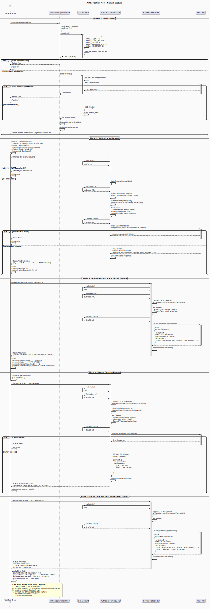

### 2. Authorization with Manual Capture

**Flow Path:** `internal/flows/authorize_manual_cature/`



**Description:**
This flow demonstrates a payment authorization with manual capture. The payment is authorized first, and the capture is performed separately using the `Capture()` method. This pattern is useful for scenarios where you need to hold funds before finalizing a transaction (e.g., order confirmation, inventory verification).

**Key Characteristics:**

- **Capture Mode:** `MANUAL`
- **Initial Status:** `AUTHORIZED` (not yet captured)
- **After Capture:** `CAPTURED`
- **Use Case:** Pre-authorization scenarios, order processing with delayed capture

**Flow Steps:**

1. **Initialization**

   - Load environment variables
   - Create Akua client and providers (AuthorizationProvider, PaymentsProvider)
   - Load JWT token

2. **Authorization Request**

   - Prepare `AuthorizeRequest` with `Capture.Mode: "MANUAL"`
   - Send POST request to `/v1/authorizations`
   - Receive authorization response with payment ID

3. **Verify Payment State (Before Capture)**

   - Retrieve payment by ID using `GetPaymentById()`
   - Verify payment status is `"AUTHORIZED"`
   - Verify capture mode is `"MANUAL"`
   - Confirm only AUTHORIZATION transaction exists

4. **Manual Capture**

   - Prepare `CaptureRequest` with payment ID
   - Send POST request to `/v1/payments/{id}/captures`
   - Process capture response

5. **Verify Final Payment State (After Capture)**
   - Retrieve payment again to verify state
   - Confirm payment status changed to `"CAPTURED"`
   - Verify two transactions exist:
     - AUTHORIZATION transaction
     - CAPTURE transaction

**Expected Result:**

- Payment initially in `AUTHORIZED` state
- After manual capture, payment transitions to `CAPTURED`
- Payment contains both AUTHORIZATION and CAPTURE transactions

**Test Function:**

```go
Test_Authorize_ManualCapture_Success
```

---
