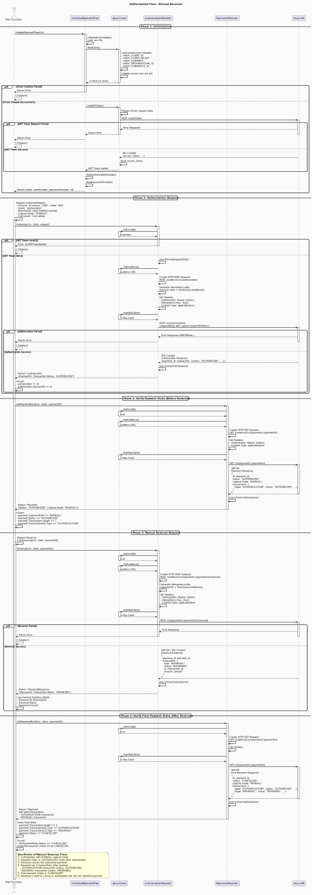

### 3. Authorization with Manual Reversal

**Flow Path:** `internal/flows/authorize_manual_reversal/`



**Description:**
This flow demonstrates canceling an authorized but not yet captured payment using reversal. Reversal is used to cancel an authorization that was created with manual capture mode. Unlike refund (which requires a captured payment), reversal cancels the authorization before capture.

**Key Characteristics:**

- **Capture Mode:** `MANUAL`
- **Initial Status:** `AUTHORIZED`
- **After Reversal:** `CANCELLED`
- **Use Case:** Canceling orders before capture, freeing authorized funds

**Flow Steps:**

1. **Initialization**

   - Load environment variables
   - Create Akua client and providers
   - Load JWT token

2. **Authorization Request**

   - Prepare `AuthorizeRequest` with `Capture.Mode: "MANUAL"`
   - Send POST request to `/v1/authorizations`
   - Payment is authorized but not captured

3. **Verify Payment State (Before Reversal)**

   - Retrieve payment by ID
   - Verify payment status is `"AUTHORIZED"`
   - Verify capture mode is `"MANUAL"`

4. **Reversal Request**

   - Call `Reversal()` method with payment ID
   - Send POST request to `/v1/payments/{id}/reversals`
   - Process reversal response

5. **Verify Final Payment State (After Reversal)**
   - Retrieve payment to verify cancellation
   - Confirm payment status changed to `"CANCELLED"`
   - Verify two transactions exist:
     - AUTHORIZATION transaction
     - REVERSAL transaction

**Expected Result:**

- Payment initially in `AUTHORIZED` state
- After reversal, payment status is `"CANCELLED"`
- Payment contains AUTHORIZATION and REVERSAL transactions
- Funds are released back to the customer

**Test Function:**

```go
Test_Authorize_ManualCapture_Success
```

**Important Notes:**

- Reversal can only be performed on authorized but not captured payments
- Once a payment is captured, you must use refund instead of reversal
- Reversal cancels the authorization and releases the hold on funds

---
